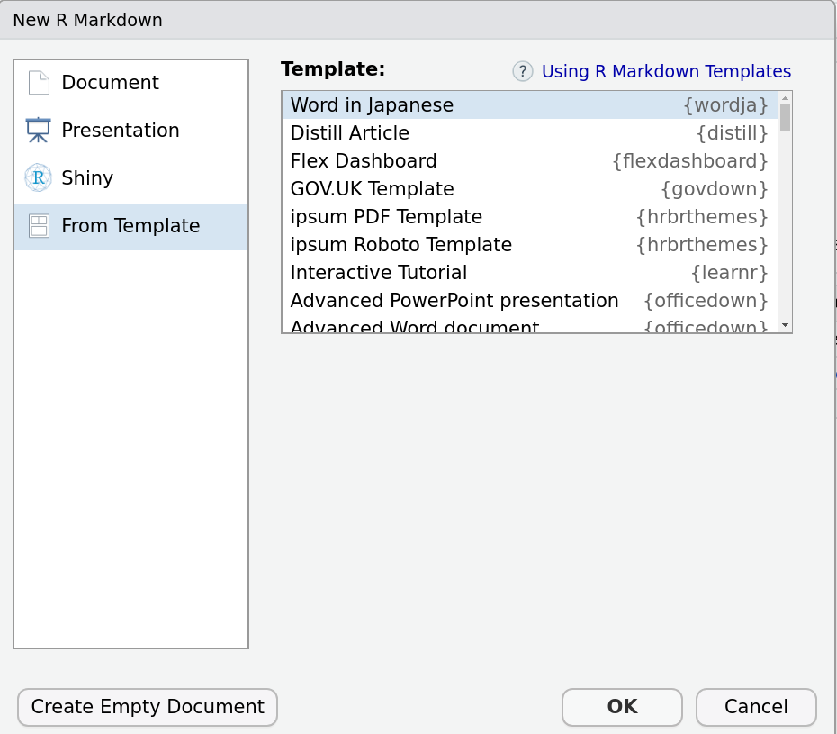

# Wordja

R Markdown template with officedown package for Japanese users

## 概要

**officedown** 等を使用した R Markdown テンプレートのみのパッケージ

PDF/HTML は [rmdja](https://github.com/Gedevan-Aleksizde/rmdja) をご検討ください

## インストール

CRAN には登録していません (登録予定もいまのところありません)

``` r
remotes::install_github("Gedevan-Aleksizde/wordja", upgrade = "never")
```

または, zip ファイルとしてダウンロードして `install.packages()` 関数でインストール.

Mac ユーザは v1.1.0 以降の **ragg** のインストールも推奨します


## 使い方

RStudio でテンプレート選択

1.  Word in Japanese
2.  Word in Japanese (Simple)

初めてなら (1), 使い慣れて構文を覚えたら, 例文のない (2)
を選択するとよいでしょう.



それぞれのファイルの出力例は以下のようにして取得できます.

``` r
file.copy(system.file("examples/rdocxja/rdocxja.docx", package = "wordja"), "rdocxja.docx")
file.copy(system.file("examples/rdocxja-simple/rdocxja-simple.docx", package = "wordja"), "rdocxja-simple.docx")
```

## 残念なお知らせ

現時点では **officedown** (0.2.2) の不具合により日本語 Windows
ユーザは相互参照が文字化けして使えない可能性があります.
相互参照を使いたければ以下に書かれているように Rmd
ファイル上で前後を改行し,
同じ行に日本語の文字が含まれないようにする必要があります.

<https://github.com/davidgohel/officedown/issues/37>

もし既存の R Markdown の書き方に慣れており, かつ
**officer**/**officedown**の新機能に関心がない場合は
`bookdown::word_document2` のほうが使いやすいかもしれません.
